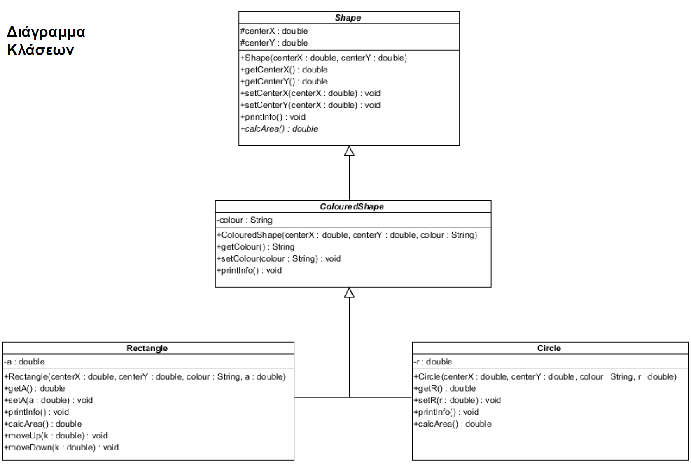

# Κληρονομικότητα - Inheritance

Είναι η δυνατότητα ορισμού υπο-κλάσεων για μια κλάση (η οποία ονομάζεται υπέρ-κλάση) οι οποίες κληρονομούν τα ήδη
ορισμένα πεδία και μεθόδους της υπέρ-κλάσης και μπορούν:

1. Να χρησιμοποιούν τα ήδη ορισμένα πεδία και μεθόδους της υπέρ-κλάσης
2. Να μεταβάλλουν κάποια απο τα ήδη ορισμένα πεδία και μεθόδους της υπέρ-κλάσης
3. Να ορίσουν επιπρόσθετα δικά τους πεδία και δικές τους μεθόδους

Η Java δεν υποστηρίζει πολλαπλή κληρονομικότητα. Αυτό σημαίνει ότι μια υπο-κλάση μπορεί να κληρονομεί μια το πολύ
κλάση και όχι παραπάνω. (Diamond problem)

Ενδιαφέρον παρουσιάζει το γεγονός ότι όλες οι κλάσεις οι οποίες δημιουργούνται, είναι υπό-κλάσεις της κλάσης `Object`
η οποία αποτελεί και τη βάση της ιεραρχίας της Java.

## Διάγραμμα κλάσεων - τάξεων

Οι κλάσεις *Shape* και *ColouredShape* είναι abstract. Μια κλάση ονομάζεται `abstract` όταν δεν μπορούμε να 
δημιουργήσουμε αντικείμενα της. Επίσης, η μέθοδος *calcArea()* είναι abstract. **Αν μια κλάση περιέχει abstract μεθόδους,
τότε είναι και η κλάση υποχρεωτικά abstract.**

Σε μια abstract κλάση, μπορούμε να ορίσουμε αναφορές της (Πολυμορφισμός). Μια abstract κλάση χρησιμοποιείται
μόνο για να κληρονομηθεί και όταν περιέχει abstract μέθοδο.

Όταν μια υπό-κλάση κληρονομεί μια abstract υπέρ-κλάση η οποία περιέχει τουλάχιστον μια abstract μέθοδο,
τότε έχει τις εξής επιλογές:

1. Η υπό-κλάση να μην οριστεί ως abstract και να επανορίσει (να τοποθετήσει δηλαδή σώμα) την κάθε abstract μέθοδο που κληρονομεί.
2. Η υπό-κλάση να οριστεί και αυτή ως abstract και να μην επανορίσει την κάθε abstract μέθοδο που κληρονομεί.

Αν μια μέθοδος της υπέρ-κλάσης, αναγράφεται και στην υπό-κλάση στο διάγραμμα κλάσεων, 
σημαίνει ότι αυτή η μέθοδος, επανορίζεται (`@Override`).

## Πολυμορφισμός

Στη Java, σε μία αναφορά μιας υπέρ-κλάσης, μπορούμε να αναθέσουμε ως τιμή της ένα αντικείμενο μιας οποιασδήποτε υπό-κλάσης της.
1. Όταν μια αναφορά μιας υπέρ-κλάσης δείχνει σε ένα αντικείμενο μιας υπό-κλάσης της, μπορεί να καλέσει μόνο τις μεθόδους του αντικειμένου που υπάρχουν ορισμένες στην υπέρ-κλάση.
2. Παρά το γεγονός αυτό, καλείται η τελευταία έκδοση των μεθόδων.

### Παράδειγμα:
Αν θεωρήσουμε για παράδειγμα μια μέθοδο m1 που υπάρχει ορισμένη στην υπέρ-κλάση Α και έχει επανοριστεί στην υπό-κλάση Β.
Αν μια αναφορά τύπου Α δείχνει σε ένα αντικείμενο τύπου Β, μπορεί (έχει δικαίωμα) να καλέσει τη m1. Όμως θα κληθεί η
έκδοση της (επανορισμένης) μεθόδου m1 που υπάρχει στην υπο-κλάση Β και όχι η έκδοση της m1 που υπάρχει στην υπέρ-κλάση Α.